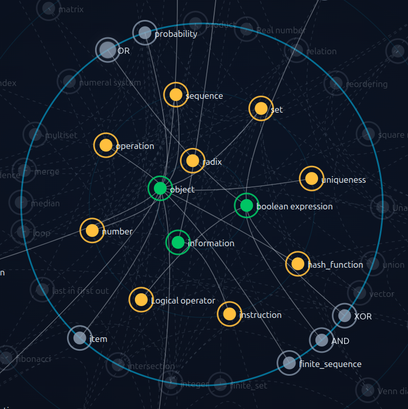
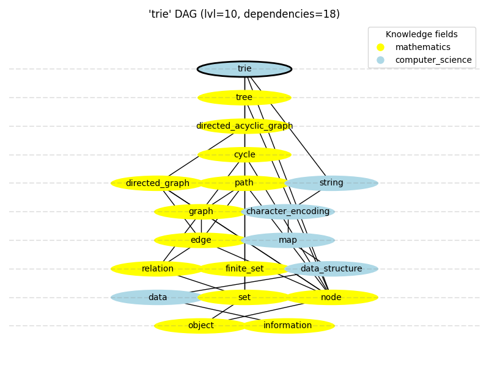

# DefinIT

## What is the project about?

*DefinIT* project aims to create a hierarchy of precise and unambiguous definitions. It is a nomenclature exercise that creates terminologies for knowledge fields and academic disciplines. DefinIT removes ambiguity and redundancy in how concepts are defined across domains.

#### Definition description

Definitions have procedural representation aiming to explain behaviors. Each definition is general. It can be a word or a phrase that represent a broad category or concept rather than a specific instance or entity. For instance, *car*, *list*, *human*, *country* represent *general terms*. *My car*, *your todo list*, *Albert Einstein*, *Poland* are singular instances of these general terms or so called *singular terms*[6]. *DefinIT* does not examine *singular terms*. In an analogy to object oriented programming, *DefinIT* examine definitions or classes, but not instances.

#### DefinIT structure

*DefinIT* can be also defined as a kind of a Knowledge Graph[1] with a directed acyclic graph (DAG) structure. DAG structure constrains the possible connections between definitions. Directed “is based on” relation is the only kind of connection between definitions. The most fundamental definitions (roots) form the foundation of the hierarchy and are independent of any other terms. They can be clearly described without usage of other definitions. The higher a definition is placed in the hierarchy, the higher level definitions it reference to. Definition dependencies define the definition level. Over time, the DAG can be updated with more precise and better placed definitions. It is a kind of living, systematic creation of a terminology for a specific field.

#### Definition properties

##### ID

The definition name and the definition field together form a unique identifier for each definition (`definition_id = <field>/<name>`). Since the field is part of the unique identifier, we can have multiple definitions with the same name but different fields e.g. "number" in mathematics and "number" in computer science may be understood differently. 

##### Subcategories

Each definition can also have subcategories. The *field* is the main, and only required category. The remaining subcategories are optional and are used for grouping and navigating through definitions (see the `mathematics/fundamental` category DAG visualized on Figure 1. as an example).

##### Content

The main part of the definition is its content, which provides the actual explanation or description of the concept. It also includes references to other definitions. A definition content can and should be updated (by contributors, experts, LLM-assisted tools, etc.) over time to reflect new knowledge or improve clarity.

  
Figure 1. Circular DAG visualization of `mathematics/fundamental` category.

## Project rationalization

#### Where the idea comes from?

First principles thinking is the act of boiling a process down to the fundamental parts that you know are true and building up from there. It is a way of understanding the world by breaking down complex problems into their most basic elements.

The idea for DefinIT emerged from a desire to represent computer science knowledge in a structured, non-redundant way where each concept builds upon clearly defined, smaller elements. Inspired by first principles thinking, the project seeks to create a hierarchy of definitions that enables learners to progress logically from foundational ideas to advanced concepts. Picking a single definition, the descendent nodes indicate what should be 
firstly understood to fully understand the chosen definition.

Keeping the DAG structure enforce us to build a definition on top of the more general concepts. It makes it clear how specific is the concept of our interest. Going down in the hierarchy we reach a low level definitions that are more general and fundamental. Climbing up on the DAG we learn more specific, high level concepts (see 'trie' dependencies DAG on Figure 2. as an example).

  
Figure 2. 'trie' dependencies DAG.

#### Literature Review

In the early stages of the field, the importance of a unambiguous expert language has been highlighted. 
In 1954, Grace Hopper, a pioneer in computer programming, wrote a "First Glossary of Programming Terminology"[2].
She was working on first programming language to express operations using English-like statements. The language was later called FLOW-MATIC, originally known as B-0 (Business Language version 0). She recognized the need for a standardized vocabulary
to facilitate communication among programmers and engineers.
This glossary was one of the first attempts to create a common language for computer science,
and it laid the groundwork for future efforts to standardize terminology in the field.

In the 1960s, the Association for Computing Machinery (ACM) established a committee to develop a standardized vocabulary for computer science.
In 1964, the committee produced the "ACM Computing Classification System"[3], which provided a hierarchical classification of computing topics and terms.
The current version (from 2012) of the "ACM Computing Classification System" is widely used in academic publishing and research to categorize computer science literature. It has a tree structure with a set of classes and subclasses that cover various areas of computer science, including algorithms, programming languages, software engineering, and artificial intelligence.

In the 1970s, the IEEE (Institute of Electrical and Electronics Engineers) also recognized the need for standardized terminology in computer science and engineering.
They established the "IEEE Standard Glossary of Software Engineering Terminology"[4], which provided definitions for key terms in software engineering.

In the 1980s and 1990s, as computer science and technology continued to evolve rapidly,
there were numerous efforts to create standardized vocabularies and glossaries in various subfields of computer science.
For example, the Object Management Group (OMG) developed the Unified Modeling Language (UML)[5],
which included a standardized set of terms and symbols for modeling software systems.
In the 2000s and beyond, the rise of the internet and online resources led to the creation of numerous glossaries and dictionaries for computer science terminology.
Many universities and organizations began to publish their own glossaries and dictionaries,
and online platforms like Wikipedia became valuable resources for finding definitions and explanations of computer science terms.

While earlier projects focused on nomenclature within a single field, DefinIT generalizes this approach across disciplines and formalizes the relationships between definitions themselves.

#### Applications of DefinIT

- Learning a new field of knowledge.
- Deepening understanding of a specific topic/term.
- Specifying an unambiguous language that experts in a field use to communicate with each other, improving the quality and clarity of communication.
- Enhancing training or tuning data, or parts of prompts, for LLM-based systems.
- Studying all specialized terms and concepts within a specific book (as a pre-reading exercise).
- Learning all specific terms and concepts within a presentation (to be better prepared for a lecture).

## How to create definitions?

It is a tedious process to create such knowledge structure. A solid understanding of an abstraction level for each definition is needed. The creation process forces a deep understanding of the concepts and their unambiguous definitions. LLM based tools can automate some part of the work.

## Mentioned materials

1. "A Common Sense View of Knowledge Graphs", Mike Bergman, https://www.mkbergman.com/2244/a-common-sense-view-of-knowledge-graphs/

2. "Report to ACM: First Glossary of Programming Terminology", Grace Hopper, https://archive.computerhistory.org/resources/text/Knuth_Don_X4100/PDF_index/k-8-pdf/k-8-u2741-2-ACM-Glossary.pdf

3. "ACM Computing Classification System", Association for Computing Machinery, https://dl.acm.org/ccs

4. "IEEE Standard Glossary of Software Engineering Terminology", IEEE, https://ieeexplore.ieee.org/document/159342

5. "Unified Modeling Language", Object Management Group, https://www.omg.org/spec/UML

6. "Singular term", Wikipedia, https://en.wikipedia.org/wiki/Singular_term

## Related materials

I. "What is Knowledge Representation in Artificial Intelligence?", 
Sumeet Bansal, https://www.analytixlabs.co.in/blog/what-is-knowledge-representation-in-artificial-intelligence

II. "Ontology", wikipedia, https://en.wikipedia.org/wiki/Ontology

III. "Theory of categories", wikipedia, https://en.wikipedia.org/wiki/Theory_of_categories

IV. "Universal (metaphysics)", wikipedia, https://en.wikipedia.org/wiki/Universal_(metaphysics)

V. "Class (philosophy)", wikipedia, https://en.wikipedia.org/wiki/Class_(philosophy)

VI. "KBpedia", https://kbpedia.org/

VII. "Charles Sanders Peirce", wikipedia, https://en.wikipedia.org/wiki/Charles_Sanders_Peirce

VIII. "A Knowledge Representation Practionary", Michael K. Bergman, https://www.mkbergman.com/a-knowledge-representation-practionary/

## For developers

## Python package

### Installation

`uv sync --extra dev`

### Build

`uv build`

### Deploy

`uv publish --token <pypi_token>`
