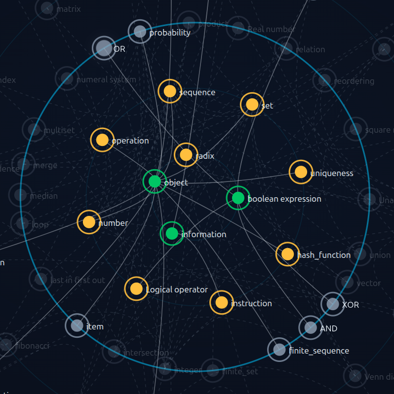
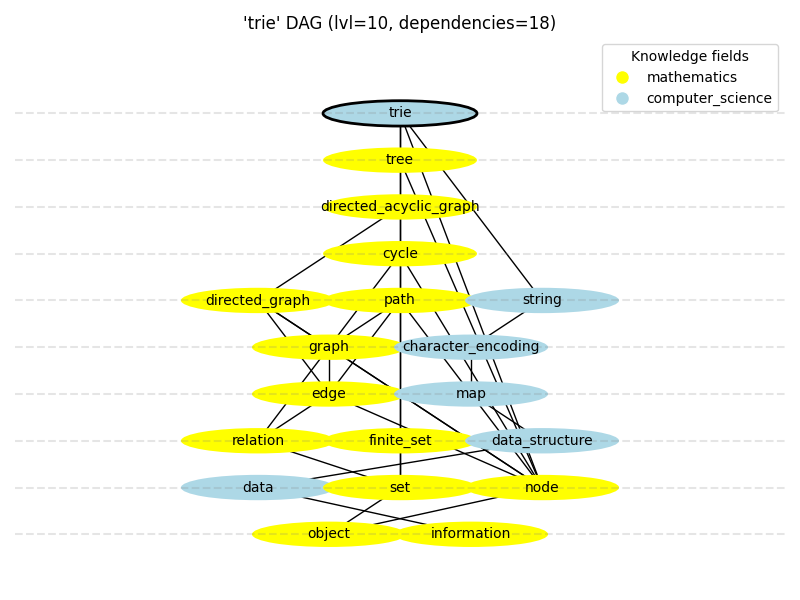

# DefinIT

## What is the project about?

*DefinIT* is a terminology structured into a directed acyclic graph (DAG). The project aims to create a hierarchy of precise and unambiguous terminologies for knowledge fields and academic disciplines. DefinIT removes ambiguity and redundancy in how concepts are defined across domains.

### Definition description

Definition can be a word or a phrase that represent a broad category, concept, or a specific instance/entity. For instance, *car*, *list*, *human*, *country* represent *general terms*. *My car*, *your todo list*, *Albert Einstein*, *Poland* are singular instances of these general terms or so called *singular terms*. *DefinIT* mainly focus on *general terms* (or *classes*, or *universals*), but it does not exclude *singular terms* (or *instances*, or *particulars*).

### DefinIT structure

*DefinIT* can be also defined as a kind of a Knowledge Graph[1]. DAG structure constrains the possible connections between definitions. Directed “is based on” relation is the only kind of connection between definitions. The most fundamental definitions (roots) form the foundation of the hierarchy and are independent of any other terms. They can be clearly described without usage of other definitions. Definition dependencies define the definition level. Over time, the DAG can be updated with more precise and better placed definitions. It is a kind of living, systematic creation of a terminology for a specific field.

### Definition properties

#### ID

The definition name and the definition field together form a unique identifier for each definition (`definition_id = <field>/<name>`). Since the field is part of the unique identifier, we can have multiple definitions with the same name but different fields e.g. "number" in mathematics and "number" in computer science may be understood differently. 

#### Field

Each definition belongs to exactly one *field* (e.g. `mathematics`, `computer_science`). The field is used for grouping and navigating through definitions (see the `mathematics/fundamental` DAG visualized on Figure 1. as an example).

#### Content

The main part of the definition is its content, which provides the actual explanation or description of the concept. It also includes references to other definitions. A definition content can and should be updated (by contributors, experts, LLM-assisted tools, etc.) over time to reflect new knowledge or improve clarity.

  
Figure 1. Circular DAG visualization of `mathematics` definitions.

## Project rationalization

### Where the idea comes from?

First principles thinking is the act of boiling a process down to the fundamental parts that you know are true and building up from there. It is a way of understanding the world by breaking down complex problems into their most basic elements.

The idea for DefinIT emerged from a desire to represent computer science knowledge in a structured, non-redundant way where each concept builds upon clearly defined, smaller elements. Inspired by first principles thinking, the project seeks to create a hierarchy of definitions that enables learners to progress logically from foundational ideas to advanced concepts. Picking a single definition, the descendent nodes indicate what should be 
firstly understood to fully understand the chosen definition.

Keeping the DAG structure enforce us to build a definition on top of the more general concepts. It makes it clear how specific is the concept of our interest. Going down in the hierarchy we reach a low level definitions that are more general and fundamental. Climbing up on the DAG we learn more specific, high level concepts (see 'trie' dependencies DAG on Figure 2. as an example).

  
Figure 2. 'trie' dependencies DAG.

### Literature Review

#### Standardized vocabularies in computing

In the early stages of the field, the importance of a unambiguous expert language has been highlighted. 
In 1954, Grace Hopper, a pioneer in computer programming, wrote a "First Glossary of Programming Terminology"[2].
She was working on first programming language to express operations using English-like statements. The language was later called FLOW-MATIC, originally known as B-0 (Business Language version 0). She recognized the need for a standardized vocabulary
to facilitate communication among programmers and engineers.
This glossary was one of the first attempts to create a common language for computer science,
and it laid the groundwork for future efforts to standardize terminology in the field.

In the 1960s, the Association for Computing Machinery (ACM) established a committee to develop a standardized vocabulary for computer science.
In 1964, the committee produced the "ACM Computing Classification System"[3], which provided a hierarchical classification of computing topics and terms.
The current version (from 2012) of the "ACM Computing Classification System" is widely used in academic publishing and research to categorize computer science literature. It has a tree structure with a set of classes and subclasses that cover various areas of computer science, including algorithms, programming languages, software engineering, and artificial intelligence.

In the 1970s, the IEEE (Institute of Electrical and Electronics Engineers) also recognized the need for standardized terminology in computer science and engineering.
They established the "IEEE Standard Glossary of Software Engineering Terminology"[4], which provided definitions for key terms in software engineering.

In the 1980s and 1990s, as computer science and technology continued to evolve rapidly,
there were numerous efforts to create standardized vocabularies and glossaries in various subfields of computer science.
For example, the Object Management Group (OMG) developed the Unified Modeling Language (UML)[5],
which included a standardized set of terms and symbols for modeling software systems.
In the 2000s and beyond, the rise of the internet and online resources led to the creation of numerous glossaries and dictionaries for computer science terminology.
Many universities and organizations began to publish their own glossaries and dictionaries,
and online platforms like Wikipedia became valuable resources for finding definitions and explanations of computer science terms.

#### Terminology science

Terminology science studies concepts, conceptual systems and their labels (terms), in contrast to lexicography, which studies words and their meanings. Its foundation is the General Theory of Terminology of Eugen Wüster [6], which treats a discipline's concepts as a structured system to which terms are then assigned. Later schools — the communicative theory of terminology [7], the sociocognitive approach [8] and frame-based terminology [9] — relativized the ideal of fully crisp, context-independent concepts. DefinIT stands in the concept-first (onomasiological) tradition: the definition object is primary, while its name and aliases are labels attached to it.

#### Philosophy of definitions

The philosophy of definition distinguishes real from nominal definitions and stipulative, descriptive, explicative and ostensive definitions, and formulates two classical criteria: conservativeness (a definition should not let us establish new claims) and eliminability (the defined term should be replaceable by its definiens) [10]. It has also long been observed that definitional chains cannot regress forever: ultimately they must terminate in terms that are understood directly — Russell argued that all nominal definitions "must lead ultimately to terms having only ostensive definitions" [10]. DefinIT operationalizes this regress as an explicit data structure: root definitions are such primitives, and the acyclicity constraint rules out definitional circularity by construction.

#### Symbol grounding

The symbol grounding problem is the problem of how the meaning of symbols can be intrinsic to a symbol system rather than "parasitic on the meanings in our heads": a dictionary followed blindly cycles endlessly from one definition to another [11]. Blondin Massé, Harnad et al. formalized dictionary graphs and defined the reachable set of a vocabulary: everything that can be learned through definitions alone once a smaller kernel vocabulary is already grounded [12]. DefinIT's roots play exactly the role of such a kernel[13] (which is an empty set) — they must be understandable without reference to other definitions — and every non-root definition is reachable from them along explicit "is based on" edges.

#### Prerequisite structures in education

Educational research has long emphasized the role of prior knowledge: in Ausubel's words, "the most important single factor influencing learning is what the learner already knows" [14][15]. Concept maps were developed by Novak to represent meaningful learning as networks of concepts connected by labeled linking phrases [15]. Knowledge space theory, introduced by Doignon and Falmagne [16] and applied in tutoring systems such as ALEKS, models a discipline as a set of concepts ordered by prerequisite relations. The "is based on" DAG of DefinIT is a curated prerequisite structure: given a definition, the definitions it ultimately builds on form a ready-made learning path, and definition levels reflect prerequisite depth.

#### Knowledge graphs, thesauri and ontologies

Semantic networks date back at least to Porphyry's commentary on Aristotle's categories and were implemented computationally by Richens (1956) and Quillian in the 1960s [17]. WordNet groups words into synsets linked by relations such as hypernymy and hyponymy [18]. SKOS is the W3C recommendation for publishing thesauri, classifications and controlled vocabularies as linked data [19]. The Gene Ontology organizes tens of thousands of terms covering three domains of biology in a directed acyclic graph using a small set of relations (`is_a`, `part_of`) [20]. What distinguishes DefinIT from these systems is the relation discipline and the role of content: there is exactly one relation type ("is based on"), it is enforced to be acyclic, and each node carries a curated, evolvable definition rather than serving as a label for entities.

#### Positioning

Earlier efforts concentrated on nomenclature within a single field. DefinIT generalizes the approach across disciplines and makes the dependency structure between definitions itself a first-class, versioned, machine-processable artifact constrained to a single acyclic relation.

### Applications of DefinIT

- Learning a new field of knowledge.
- Deepening understanding of a specific topic/term.
- Specifying an unambiguous language that experts in a field reference to, improving the quality and clarity of communication.
- Enhancing training or tuning data, or parts of prompts, for LLM-based systems.
- Studying all specialized terms and concepts within a specific book (as a pre-reading exercise).
- Learning all specific terms and concepts within a presentation (to be better prepared for a lecture).

## How to create definitions?

It is a tedious process to create such knowledge structure. A solid understanding of an abstraction level for each definition is needed. The creation process forces a deep understanding of the concepts and their unambiguous definitions. LLM based tools can automate some part of the work.

## Mentioned materials

1. "A Common Sense View of Knowledge Graphs", Mike Bergman, https://www.mkbergman.com/2244/a-common-sense-view-of-knowledge-graphs/

2. "Report to ACM: First Glossary of Programming Terminology", Grace Hopper, https://archive.computerhistory.org/resources/text/Knuth_Don_X4100/PDF_index/k-8-pdf/k-8-u2741-2-ACM-Glossary.pdf

3. "ACM Computing Classification System", Association for Computing Machinery, https://dl.acm.org/ccs

4. "IEEE Standard Glossary of Software Engineering Terminology", IEEE, https://ieeexplore.ieee.org/document/159342

5. "Unified Modeling Language", Object Management Group, https://www.omg.org/spec/UML

6. E. Wüster, "Einführung in die allgemeine Terminologielehre und terminologische Lexikographie", Springer, 1979.

7. M. T. Cabré, "La terminología: representación y comunicación", Empúries, 1999.

8. R. Temmerman, "Towards New Ways of Terminology Description: The Sociocognitive Approach", John Benjamins, 2000.

9. P. Faber et al., "Process-oriented terminology management in the domain of Coastal Engineering", Terminology 12(2), 2006.

10. "Definitions", Stanford Encyclopedia of Philosophy, https://plato.stanford.edu/entries/definitions/

11. S. Harnad, "The Symbol Grounding Problem", Physica D 42(1-3), 1990.

12. A. Blondin Massé, G. Chicoisne, Y. Gargouri, S. Harnad, O. Picard, O. Marcotte, "How Is Meaning Grounded in Dictionary Definitions?", TextGraphs-3 at COLING 2008, https://arxiv.org/abs/0806.3710

13. Olivier Picard, Alexandre Blondin Masse, and others, "Hierarchies in Dictionary Definition Space", 2009, https://arxiv.org/abs/0911.5703v1

14. D. P. Ausubel, "Educational Psychology: A Cognitive View", Holt, Rinehart and Winston, 1968.

15. J. D. Novak, D. B. Gowin, "Learning How to Learn", Cambridge University Press, 1984.

16. J.-P. Doignon, J.-C. Falmagne, "Spaces for the assessment of knowledge", International Journal of Man-Machine Studies 29(2), 1985.

17. J. F. Sowa, "Semantic Networks", Encyclopedia of Artificial Intelligence, Wiley, 1987.

18. G. A. Miller, "WordNet: A Lexical Database for English", Communications of the ACM 38(11), 1995.

19. A. Miles, S. Bechhofer (eds.), "SKOS Simple Knowledge Organization System Reference", W3C Recommendation, 2009, https://www.w3.org/TR/skos-reference/

20. The Gene Ontology Consortium, "Gene ontology: tool for the unification of biology", Nature Genetics 25(1), 2000.

## Related materials/concepts/links (not referenced in the text)

I. "What is Knowledge Representation in Artificial Intelligence?", 
Sumeet Bansal, https://www.analytixlabs.co.in/blog/what-is-knowledge-representation-in-artificial-intelligence

II. "Ontology", wikipedia, https://en.wikipedia.org/wiki/Ontology

III. "Theory of categories", wikipedia, https://en.wikipedia.org/wiki/Theory_of_categories

IV. "Universal (metaphysics)", wikipedia, https://en.wikipedia.org/wiki/Universal_(metaphysics)

V. "Class (philosophy)", wikipedia, https://en.wikipedia.org/wiki/Class_(philosophy)

VI. "KBpedia", https://kbpedia.org/

VII. "Charles Sanders Peirce", wikipedia, https://en.wikipedia.org/wiki/Charles_Sanders_Peirce

VIII. "A Knowledge Representation Practionary", Michael K. Bergman, https://www.mkbergman.com/a-knowledge-representation-practionary/

IX. "Knowledge space", wikipedia, https://en.wikipedia.org/wiki/Knowledge_space

X. "Concept map", wikipedia, https://en.wikipedia.org/wiki/Concept_map

XI. "WordNet", wikipedia, https://en.wikipedia.org/wiki/WordNet

XII. "Gene Ontology", wikipedia, https://en.wikipedia.org/wiki/Gene_Ontology

XIII. "Semantic network", wikipedia, https://en.wikipedia.org/wiki/Semantic_network

XIV. "Formal concept analysis", wikipedia, https://en.wikipedia.org/wiki/Formal_concept_analysis

XV. "Metamath", wikipedia, https://en.wikipedia.org/wiki/Metamath

XVI. "Symbol grounding problem", wikipedia, https://en.wikipedia.org/wiki/Symbol_grounding_problem

XVII. "Applying Terminological Methods to Lexicographic Work: Terms and Their Domains", Ana Salgado/Rute Costa/Toma Tasovac, https://d-nb.info/1277050627/34

XVIII. "International Information Centre for Terminology", wikipedia, https://en.wikipedia.org/wiki/Infoterm

XIX. "Wüster’s View of Terminology", Mitja Trojar, https://www.academia.edu/34943245/W%C3%BCsters_View_of_Terminology

XX. "The General Theory of Terminology: A Literature Review and a Critical discussion.", Kirsten Packeiser

XXI. "Conceptual graph", John Florian Sowa, https://en.wikipedia.org/wiki/Conceptual_graph

XXII. "Partial order", https://en.wikipedia.org/wiki/Partially_ordered_set

XXIII. "Topological sorting", https://en.wikipedia.org/wiki/Topological_sorting

XXIV. "Educational prerequirement"/"Educational prerequisite"

XXV. "Hypernymy and hyponymy", https://en.wikipedia.org/wiki/Hypernymy_and_hyponymy

XXVI. "Synonymy and polysemy", Jiwei Ci, https://www.sciencedirect.com/science/article/abs/pii/0024384187900507

XXVII. "Unit of understanding", Rita Temmerman, https://www.jbe-platform.com/content/books/9789027257789-tlrp.23.15tem, https://scispace.com/pdf/towards-new-ways-of-terminology-description-the-4suqi4tgj1.pdf

XXVIII. "Infinite regress", wikipedia, https://en.wikipedia.org/wiki/Infinite_regress

XXIX. "Definienda/definientes"

XXX. "Disambiguation of a dictionary"

XXXI. "Knowledge space", wikipedia, https://en.wikipedia.org/wiki/Knowledge_space

XXXII. "Singular term", Wikipedia, https://en.wikipedia.org/wiki/Singular_term

XXXIII. "Terminology", Wikipedia, https://en.wikipedia.org/wiki/Terminology_science

XXXIV. "Semantic Networks", John F. Sowa, https://www.jfsowa.com/pubs/semnet.htm

XXXV. "The GO hierarchy", https://www.geneontology.org/docs/ontology-documentation/

XXXVI. "Ontology relations", https://www.geneontology.org/docs/ontology-relations/

XXXVII. "Theory of descriptions", https://en.wikipedia.org/wiki/Theory_of_descriptions

XXXVIII. "Logical atomism", https://en.wikipedia.org/wiki/Logical_atomism

XXXIX. "Metaphysics", https://en.wikipedia.org/wiki/Metaphysics

XL. 

## For developers

## Python package

### Installation

`uv sync --extra dev`

### Build

`uv build`

### Deploy

`uv publish --token <pypi_token>`
